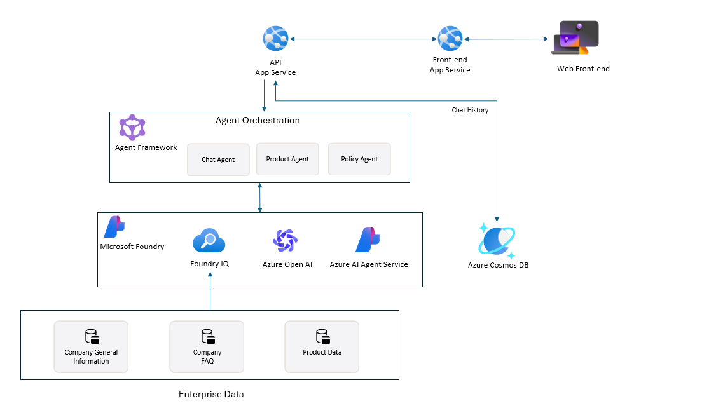

# Customer Chatbot Solution Accelerator
Note: This repository is in private preview. Certain features might not be supported or might have constrained capabilities. For more information, see [Supplemental Terms of Use for Microsoft Azure Previews](https://azure.microsoft.com/en-us/support/legal/preview-supplemental-terms).

This solution accelerator empowers organizations to build intelligent, conversational customer service experiences by leveraging Azure AI Foundry's agent framework. With seamless integration of specialized AI agents, and enterprise-grade data services, teams can create chatbots that provide personalized product recommendations, answer policy questions, and deliver exceptional customer support. The solution combines a modern e-commerce frontend with an intelligent backend that uses an orchestrator agent to route customer queries to specialized agents (Product Lookup and Policy/Knowledge), ensuring accurate, contextual responses grounded in product catalogs and policy documents. By unifying AI capabilities with scalable cloud infrastructure, organizations can deliver 24/7 customer support that understands context, maintains conversation history, and provides actionable insights to improve customer satisfaction and operational efficiency.

---

[**SOLUTION OVERVIEW**](#solution-overview)  \| [**QUICK DEPLOY**](#quick-deploy)  \| [**BUSINESS SCENARIO**](#business-scenario)  \| [**SUPPORTING DOCUMENTATION**](#supporting-documentation)

---

## Solution overview

Leverages Azure AI Foundry's agent framework, Azure AI Search, and Cosmos DB to create an intelligent customer chatbot with specialized agents for product lookup and knowledge management. The solution features a modern React-based e-commerce frontend with integrated chat interface, enabling customers to browse products, get personalized recommendations, and receive support through natural language conversations. An orchestrator agent intelligently routes queries to specialized agents (Product Lookup and Policy/Knowledge), which use hybrid search across product catalogs and policy documents to ensure accurate, contextual answers.

### Solution architecture

The solution consists of:

||
|---|

### Additional resources

For detailed technical information, see the component READMEs:

[Technical Architecture](./documents/TechnicalArchitecture.md)

---

## Features

### Key features

  

Click to learn more about the key features this solution enables
  

**Built on Azure AI Foundry Agent Framework**

- **Intelligent agent orchestration**  
  Leverage Azure AI Foundry's agent framework with an orchestrator agent that uses automatic tool selection to route customer queries to specialized agents (Product Lookup and Policy/Knowledge). The orchestrator analyzes user intent and automatically invokes the appropriate specialist agent as a tool, ensuring queries are handled by the most capable agent for each task.

- **Hybrid search capabilities**  
  Azure AI Search provides fast, accurate product discovery and policy document retrieval using semantic and keyword search, enabling natural language queries across product catalogs and knowledge bases. Specialized agents access search indexes to retrieve relevant information from product catalogs and policy documents.

- **Natural language interaction**  
  Azure AI Foundry's agent framework orchestrates multi-agent workflows using GPT-4o-mini to deliver conversational, context-aware responses that understand customer intent. The framework maintains conversation threads and context across sessions, enabling natural, flowing conversations with specialized agents.

- **Modern e-commerce experience**  
  React-based frontend with dual-panel layout featuring product browsing and integrated AI chat assistant for seamless shopping and support experiences

- **Scalable data architecture**  
  Cosmos DB stores product catalogs, customer orders, and chat history with high availability and global distribution, ensuring fast access to customer and product data

---
## Getting Started

### Quick deploy

#### How to install or deploy

Follow the quick deploy steps on the deployment guide to deploy this solution to your own Azure subscription.

[Click here to launch the deployment guide](./documents/DeploymentGuide.md)

|  |  | 
|---|---|

> ⚠️ **Important: Check Azure OpenAI Quota Availability**  
> To ensure sufficient quota is available in your subscription, please follow [quota check instructions guide](./documents/QuotaCheck.md) before you deploy the solution.

## Guidance

### Prerequisites and costs

To deploy this solution accelerator, ensure you have access to an [Azure subscription](https://azure.microsoft.com/free/) with the necessary permissions to create **resource groups, resources, app registrations, and assign roles at the resource group level**. This should include Contributor role at the subscription level and Role Based Access Control role on the subscription and/or resource group level.

Here are some example regions where the services are available: East US, East US2, Australia East, UK South, France Central.

Check the [Azure Products by Region](https://azure.microsoft.com/en-us/explore/global-infrastructure/products-by-region/?products=all&regions=all) page and select a **region** where the following services are available.

Pricing varies by region and usage, so it isn't possible to predict exact costs for your usage. The majority of Azure resources used in this infrastructure are on usage-based pricing tiers. However, some services—such as Azure Container Registry, which has a fixed cost per registry per day, and others like Cosmos DB or App Service when provisioned—may incur baseline charges regardless of actual usage.

Use the [Azure pricing calculator](https://azure.microsoft.com/en-us/pricing/calculator) to calculate the cost of this solution in your subscription. 

Review a [sample pricing sheet](https://azure.com/e/708895d4fc4449b1826016fad8a83fe0) in the event you want to customize and scale usage.

_Note: This is not meant to outline all costs as selected SKUs, scaled use, customizations, and integrations into your own tenant can affect the total consumption of this sample solution. The sample pricing sheet is meant to give you a starting point to customize the estimate for your specific needs._

>⚠️ **Important:** To avoid unnecessary costs, remember to take down your app if it's no longer in use, either by deleting the resource group in the Portal or running `azd down`.

## Resources

| Product | Description | Tier / Expected Usage Notes | Cost |
|---|---|---|---|
| [Azure AI Foundry](https://learn.microsoft.com/en-us/azure/ai-foundry) | Used to orchestrate and build AI workflows with specialized agents for customer service. | Free Tier | [Pricing](https://azure.microsoft.com/pricing/details/ai-studio/) |
| [Azure AI Services (OpenAI)](https://learn.microsoft.com/en-us/azure/cognitive-services/openai/overview) | Enables language understanding and chat capabilities using GPT models for conversational AI. | S0 Tier; pricing depends on token volume and model used (e.g., GPT-4o-mini). | [Pricing](https://azure.microsoft.com/pricing/details/cognitive-services/) |
| [Azure AI Search](https://learn.microsoft.com/en-us/azure/search/search-what-is-azure-search) | Provides hybrid search capabilities for product catalogs and policy documents with semantic and keyword search. | Basic Tier; pricing based on search units and data storage. | [Pricing](https://azure.microsoft.com/pricing/details/search/) |
| [Azure App Service](https://learn.microsoft.com/en-us/azure/app-service/overview) | Hosts the frontend React application and backend FastAPI services. | Basic or Standard plan; includes a free tier for development. | [Pricing](https://azure.microsoft.com/pricing/details/app-service/windows/) |
| [Azure Container Registry](https://learn.microsoft.com/en-us/azure/container-registry/container-registry-intro) | Stores and serves container images used by Azure App Service. | Basic Tier; fixed daily cost per registry. | [Pricing](https://azure.microsoft.com/pricing/details/container-registry/) |
| [Azure Cosmos DB](https://learn.microsoft.com/en-us/azure/cosmos-db/introduction) | Stores product catalogs, customer orders, and chat conversation history. | Serverless or provisioned throughput; pricing based on request units and storage. | [Pricing](https://azure.microsoft.com/pricing/details/cosmos-db/) |
| [Azure Monitor / Log Analytics](https://learn.microsoft.com/en-us/azure/azure-monitor/logs/log-analytics-overview) | Collects and analyzes telemetry and logs from services and applications. | Pay-as-you-go; charges based on data ingestion volume. | [Pricing](https://azure.microsoft.com/pricing/details/monitor/) |

---

## Business scenario

The solution provides a modern e-commerce interface with integrated AI chat assistant, enabling customers to browse products, get recommendations, and receive support through natural language conversations.

---

The sample data illustrates how this accelerator could be used for a customer service scenario across e-commerce industries. 

In this scenario, Contoso Paints is an e-commerce paint retailer looking to provide exceptional customer support through an intelligent chatbot. Previously, customers had to navigate complex product catalogs, search through policy documents, and contact support for assistance. Leveraging the solution accelerator, customers now have access to a conversational AI assistant that can help them find the perfect paint colors, answer questions about warranties and returns, and provide personalized product recommendations. The chatbot uses an orchestrator agent that intelligently routes queries to specialized agents—Product Lookup Agent for finding paints and product information, and Policy/Knowledge Agent for policy questions and customer support—ensuring customers receive accurate, contextual responses in natural language (e.g., "I'm looking for a cool, blue-toned paint that feels calm but not gray", "What's your warranty policy?").

⚠️ The sample data used in this repository is synthetic and generated. The data is intended for use as sample data only.

### Business value

  
Click to learn more about what value this solution provides

  - **Intelligent customer support** 

Enable conversational AI agents that understand customer intent and provide accurate, contextual responses by routing queries to specialized agents that access product catalogs and policy documents through Azure AI Search. The orchestrator agent automatically selects the appropriate specialist (Product Lookup or Policy/Knowledge) based on the query, reducing support ticket volume and improving customer satisfaction with 24/7 availability.

- **Accelerated product discovery**

Help customers find products faster through natural language queries and intelligent search. Enable personalized recommendations based on customer needs, preferences, and conversation context, increasing conversion rates and average order value.

- **Scalable and maintainable architecture**

Deliver consistent customer experiences at scale with a microservices architecture that separates concerns between product lookup and knowledge management. The Azure AI Foundry agent framework enables easy extension with new agents, data sources, or capabilities as business needs evolve.

---

## Supporting documentation

### Security guidelines

This solution uses [Managed Identity](https://learn.microsoft.com/en-us/entra/identity/managed-identities-azure-resources/overview) for secure access to Azure resources during local development and production deployment, eliminating the need for hard-coded credentials.

To maintain strong security practices, it is recommended that GitHub repositories built on this solution enable [GitHub secret scanning](https://docs.github.com/code-security/secret-scanning/about-secret-scanning) to detect accidental secret exposure.

Additional security considerations include:

- Enabling [Microsoft Defender for Cloud](https://learn.microsoft.com/en-us/azure/defender-for-cloud) to monitor and secure Azure resources.
- Using [Virtual Networks](https://learn.microsoft.com/en-us/azure/app-service/networking-features) or [firewall rules](https://learn.microsoft.com/en-us/azure/app-service/app-service-ip-restrictions) to protect Azure App Service from unauthorized access.
- Implementing authentication and authorization for the frontend application using Microsoft Entra ID or other identity providers.

### Cross references

Check out similar solution accelerators

| Solution Accelerator | Description |
|---|---|
| [Agentic Applications for Unified Data Foundation](https://github.com/microsoft/agentic-applications-for-unified-data-foundation-solution-accelerator) | Empowers organizations to make faster, smarter decisions at scale by leveraging agentic AI solutions built on a unified data foundation with Microsoft Fabric. |

## Provide feedback

Have questions, find a bug, or want to request a feature? [Submit a new issue](https://github.com/microsoft/customer-chatbot-solution-accelerator/issues) on this repo and we'll connect.

## Responsible AI Transparency FAQ 

Please refer to [Transparency FAQ](./TRANSPARENCY_FAQ.md) for responsible AI transparency details of this solution accelerator.

## Disclaimers

To the extent that the Software includes components or code used in or derived from Microsoft products or services, including without limitation Microsoft Azure Services (collectively, "Microsoft Products and Services"), you must also comply with the Product Terms applicable to such Microsoft Products and Services. You acknowledge and agree that the license governing the Software does not grant you a license or other right to use Microsoft Products and Services. Nothing in the license or this ReadMe file will serve to supersede, amend, terminate or modify any terms in the Product Terms for any Microsoft Products and Services.

You must also comply with all domestic and international export laws and regulations that apply to the Software, which include restrictions on destinations, end users, and end use. For further information on export restrictions, visit https://aka.ms/exporting.

You acknowledge that the Software and Microsoft Products and Services (1) are not designed, intended or made available as a medical device(s), and (2) are not designed or intended to be a substitute for professional medical advice, diagnosis, treatment, or judgment and should not be used to replace or as a substitute for professional medical advice, diagnosis, treatment, or judgment. Customer is solely responsible for displaying and/or obtaining appropriate consents, warnings, disclaimers, and acknowledgements to end users of Customer's implementation of the Online Services.

You acknowledge the Software is not subject to SOC 1 and SOC 2 compliance audits. No Microsoft technology, nor any of its component technologies, including the Software, is intended or made available as a substitute for the professional advice, opinion, or judgement of a certified financial services professional. Do not use the Software to replace, substitute, or provide professional financial advice or judgment.

BY ACCESSING OR USING THE SOFTWARE, YOU ACKNOWLEDGE THAT THE SOFTWARE IS NOT DESIGNED OR INTENDED TO SUPPORT ANY USE IN WHICH A SERVICE INTERRUPTION, DEFECT, ERROR, OR OTHER FAILURE OF THE SOFTWARE COULD RESULT IN THE DEATH OR SERIOUS BODILY INJURY OF ANY PERSON OR IN PHYSICAL OR ENVIRONMENTAL DAMAGE (COLLECTIVELY, "HIGH-RISK USE"), AND THAT YOU WILL ENSURE THAT, IN THE EVENT OF ANY INTERRUPTION, DEFECT, ERROR, OR OTHER FAILURE OF THE SOFTWARE, THE SAFETY OF PEOPLE, PROPERTY, AND THE ENVIRONMENT ARE NOT REDUCED BELOW A LEVEL THAT IS REASONABLY, APPROPRIATE, AND LEGAL, WHETHER IN GENERAL OR IN A SPECIFIC INDUSTRY. BY ACCESSING THE SOFTWARE, YOU FURTHER ACKNOWLEDGE THAT YOUR HIGH-RISK USE OF THE SOFTWARE IS AT YOUR OWN RISK.
