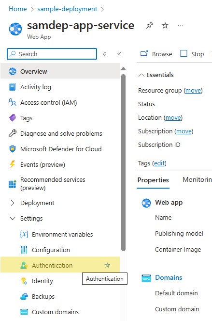
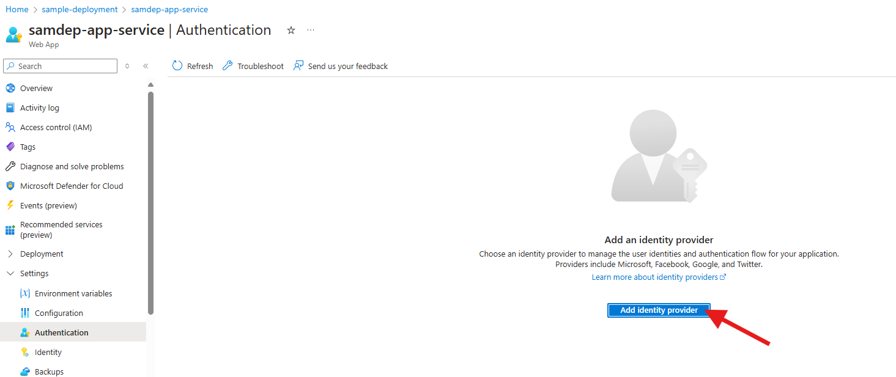
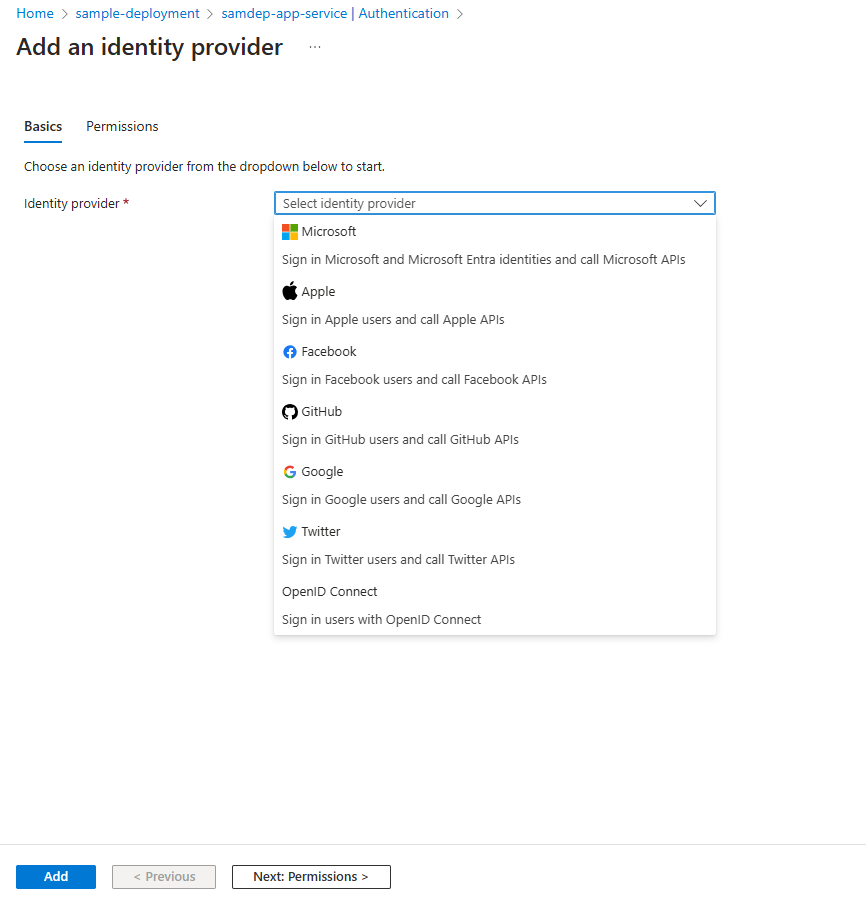
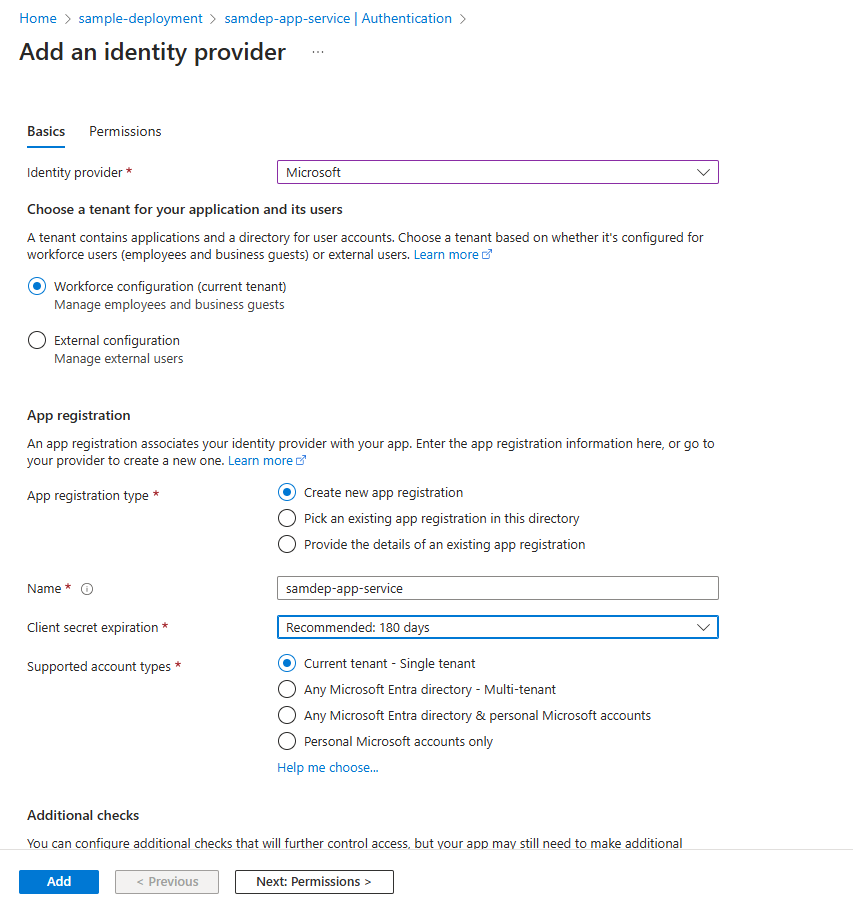
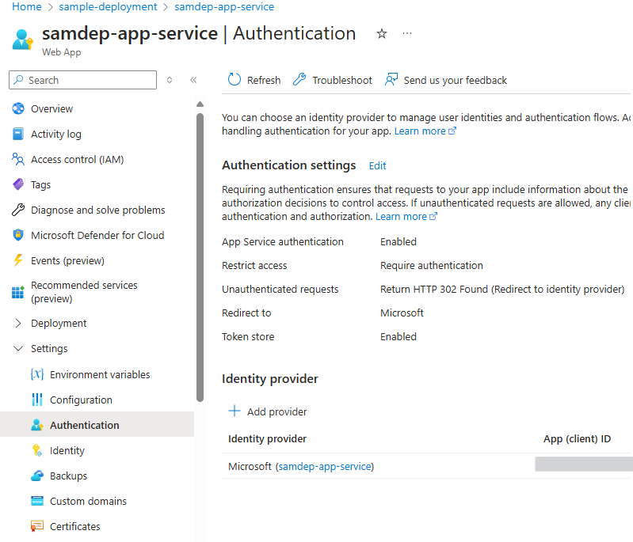

The frontend uses Azure App Service authentication to sign users in. The frontend
sends the resulting signed Microsoft Entra token to the backend as an
`Authorization: Bearer` credential. The Python backend validates the token signature,
issuer, audience, tenant, and expiration before using any identity claims.

> [!IMPORTANT]
> Do not enable backend App Service authentication for this configuration. Do not
> send `X-MS-CLIENT-PRINCIPAL-*` headers from clients. The backend ignores those
> headers because callers can forge them.

## Prerequisites

- Access to Microsoft Entra ID
- Permission to create or manage app registrations
- Azure CLI and Azure Developer CLI (`azd`)

## Configure frontend App Service authentication

1. Open the frontend App Service in the Azure portal.
2. Select **Authentication** from the menu.

   

3. Select **Add identity provider**.

   

4. Select **Microsoft** as the identity provider.

   

5. Create an app registration or select an existing single-tenant registration.
   See [Create a new app registration](./CreateNewAppRegistration.md) when the
   portal cannot create one automatically.

   

6. Enable the App Service token store.
7. Add the identity provider and confirm that the frontend requires users to sign in.

   

Repeat these steps for both frontend App Services. They can use the same app
registration when both applications are intended for the same tenant and audience.

## Configure backend token validation

Copy the app registration's **Application (client) ID**, then set it in the `azd`
environment before provisioning:

```powershell
azd env set AZURE_ENV_ENTRA_CLIENT_ID <application-client-id>
```

The vanilla Bicep deployment sets these backend application settings:

- `ENTRA_AUTH_CLIENT_ID` to the application client ID
- `ENTRA_AUTH_TENANT_ID` to the deployment subscription tenant ID

For local development, set the same values in each backend `.env` file. A client
secret is not required because the backend validates tokens and does not acquire
tokens as the application.

Tokenless requests continue as guest requests. Requests with malformed, expired,
wrong-tenant, wrong-audience, or invalid-signature bearer tokens receive
`401 Unauthorized`.

## Verify the configuration

1. Sign in through a frontend App Service.
2. Confirm that `/.auth/me` returns an `id_token`.
3. Call `/api/auth/me` through the frontend and confirm that it returns
   `is_authenticated: true`.
4. Call the backend with forged `X-MS-CLIENT-PRINCIPAL-ID` and
   `X-MS-CLIENT-PRINCIPAL-NAME` headers but without a bearer token.
5. Confirm that the backend returns the guest identity rather than the forged user.
6. Alter one character in a bearer token and confirm that the backend returns `401`.
