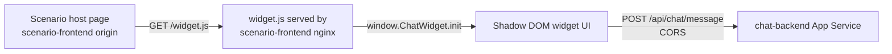

## Overview

The Customer Chatbot Solution Accelerator ships a floating chat widget that any host page can render with a single script include and one initialization call. The widget is produced from the chat frontend as a standalone JavaScript bundle (`widget.js`), packaged into the scenario frontend image, and served from the scenario site's own origin. The widget mounts inside a Shadow DOM so host-page CSS does not leak into the chat UI, and it calls the chat backend directly using CORS.

This guide describes how the widget is built, where it is served from, how the scenario host page loads it, and what to check when validating an embed in local development or on Azure.

## Widget architecture



Three components are involved:

* Chat frontend at [chat-app/frontend](../chat-app/frontend), which builds two outputs from the same source: the full chat SPA and the standalone widget bundle.
* Scenario frontend at [scenario-app/frontend](../scenario-app/frontend), which acts as the host page that embeds the widget. Its Docker build copies `widget.js` from the chat frontend build so both are served from the same nginx.
* Chat backend at [chat-app/backend](../chat-app/backend), which serves `POST /api/chat/*` endpoints with an explicit CORS allowlist that includes the scenario frontend origin.

## How `widget.js` is built

The chat frontend has two Vite configurations. The default configuration builds the full SPA, and [vite.widget.config.ts](../chat-app/frontend/vite.widget.config.ts) builds the widget bundle in library mode:

```ts
build: {
  emptyOutDir: false,
  outDir: 'dist',
  sourcemap: true,
  lib: {
    entry: path.resolve(__dirname, 'src/widget-bootstrap.ts'),
    name: 'ChatWidget',
    formats: ['iife'],
    fileName: () => 'widget.js',
  },
  rollupOptions: {
    output: { inlineDynamicImports: true, banner: 'var process={env:{NODE_ENV:"production"}};' },
  },
}
```

Key properties of the bundle:

* IIFE format so the file works with a plain `<script>` tag and no module loader.
* Registers `window.ChatWidget` as its global entry point.
* Inlines widget CSS via `import widgetCss from './widget-bundle.css?inline'` so the Shadow DOM can attach styles without a second network request.
* Uses a single output file with `inlineDynamicImports: true` to avoid dynamic chunk loading from a different path.

The `build` script in [chat-app/frontend/package.json](../chat-app/frontend/package.json) runs both builds in sequence:

```json
"build": "vite build && vite build -c vite.widget.config.ts"
```

After a build, `chat-app/frontend/dist/` contains both the SPA and `widget.js`.

## How the scenario image includes the widget

The scenario frontend Dockerfile is multi-stage. Stage one builds the chat frontend to produce `widget.js`. Stage two builds the scenario SPA. The final image copies the widget bundle into the scenario dist so nginx serves both from the same origin. See [scenario-app/frontend/Dockerfile](../scenario-app/frontend/Dockerfile):

```dockerfile
FROM mcr.microsoft.com/azurelinux/base/nodejs:20 AS widget-builder
WORKDIR /src/chat-app/frontend
COPY chat-app/frontend/package*.json ./
RUN npm ci --legacy-peer-deps
COPY chat-app/frontend/ ./
RUN npm run build

FROM mcr.microsoft.com/azurelinux/base/nodejs:20 AS app-builder
WORKDIR /src/scenario-app/frontend
COPY scenario-app/frontend/package*.json ./
RUN npm ci --legacy-peer-deps
COPY scenario-app/frontend/ ./
RUN npm run build
COPY --from=widget-builder /src/chat-app/frontend/dist/widget.js ./dist/widget.js
```

Because `widget.js` sits alongside the scenario SPA in `/usr/share/nginx/html`, the browser resolves `/widget.js` on the same origin as the host page. Same-origin serving avoids cross-origin script blocking and keeps the widget subject to the host page's CSP.

## How the host page loads the widget

The scenario frontend embeds the widget automatically at startup. Two files drive the flow:

* [scenario-app/frontend/src/embedChatWidget.ts](../scenario-app/frontend/src/embedChatWidget.ts) injects the `<script>` tag and wires `ChatWidget.init` once the script loads.
* [scenario-app/frontend/src/main.tsx](../scenario-app/frontend/src/main.tsx) calls `embedChatWidget()` after rendering the React root.

The embed loader looks like this:

```ts
export function embedChatWidget() {
  const base = trimSlash(window.location.origin);
  if (!base || document.getElementById('ccsa-chat-widget-script')) {
    return;
  }
  const script = document.createElement('script');
  script.id = 'ccsa-chat-widget-script';
  script.src = `${base}/widget.js`;
  script.async = true;
  script.addEventListener('load', () => {
    const apiBase =
      runtimeStr('VITE_CHAT_API_BASE_URL') ||
      String(import.meta.env.VITE_CHAT_API_BASE_URL ?? '').trim() ||
      'http://localhost:8000';
    const themeRaw = (runtimeStr('VITE_CHAT_WIDGET_THEME') ||
      String(import.meta.env.VITE_CHAT_WIDGET_THEME ?? '').trim()).toLowerCase();
    const theme = themeRaw === 'light' || themeRaw === 'dark' ? themeRaw : undefined;
    const w = window.ChatWidget as { init?: (c: unknown) => void };
    w?.init?.({ apiBaseUrl: trimSlash(apiBase), theme });
  });
  document.body.appendChild(script);
}
```

Behavior notes:

* The widget script always loads from the current page origin, so the scenario site is responsible for hosting it.
* `apiBaseUrl` and `theme` come from `window.__RUNTIME_CONFIG__` first, then Vite build-time env, then a localhost fallback. Runtime injection is set up in [scenario-app/frontend/startup.sh](../scenario-app/frontend/startup.sh) at container start.
* The script tag is idempotent through the `ccsa-chat-widget-script` id, so repeated calls do nothing.

## Public embed API

The widget exposes a small runtime API on `window.ChatWidget`. It is defined by `WidgetInitConfig` in [chat-app/frontend/src/widget.tsx](../chat-app/frontend/src/widget.tsx):

```ts
type WidgetInitConfig = {
  apiBaseUrl: string;         // Chat backend origin, no trailing slash
  theme?: 'light' | 'dark';   // Optional UI theme
  scriptBaseUrl?: string;     // Optional override for the widget script origin
};

window.ChatWidget.init({ apiBaseUrl, theme });
```

`init` performs these steps:

1. Trims trailing slashes on `apiBaseUrl` and `scriptBaseUrl`.
2. Configures the widget's internal API base override and embed auth base.
3. Unmounts any previously mounted widget so `init` can be called safely more than once.
4. Creates a mount host `<div id="ccsa-chat-widget-host">`, attaches an open Shadow Root, injects the inlined widget CSS, and renders `WidgetApp` inside the shadow tree.

## Chat backend contract

The widget targets the same routes as the full chat SPA:

* Base router prefix `/api/chat` from [chat-app/backend/app/routers/chat.py](../chat-app/backend/app/routers/chat.py).
* Configuration router prefix `/api/chat` from [chat-app/backend/app/routers/chat_config.py](../chat-app/backend/app/routers/chat_config.py).
* CORS is configured in [chat-app/backend/app/main.py](../chat-app/backend/app/main.py) with `allow_credentials=True` and an explicit list of allowed origins.

The origin allowlist is provided by the infrastructure. See the chat backend configuration in [infra/bicep/main.bicep](../infra/bicep/main.bicep):

```bicep
ALLOWED_ORIGINS_STR: 'https://${chatWebAppName}.azurewebsites.net,https://${scenarioWebAppName}.azurewebsites.net'
```

The scenario frontend receives its chat API URL through:

```bicep
VITE_CHAT_API_BASE_URL: chat_backend_app.outputs.appUrl
```

## Runtime configuration

The scenario frontend injects runtime values at container startup so the same image works across environments. See [scenario-app/frontend/startup.sh](../scenario-app/frontend/startup.sh):

```sh
cat > /usr/share/nginx/html/runtime-config.js << EOF
window.__RUNTIME_CONFIG__ = {
  VITE_API_BASE_URL: '${VITE_API_BASE_URL}',
  VITE_CHAT_API_BASE_URL: '${VITE_CHAT_API_BASE_URL}',
  VITE_CHAT_WIDGET_THEME: '${VITE_CHAT_WIDGET_THEME}',
  VITE_SCENARIO: '${VITE_SCENARIO}',
  VITE_HOST_APP_TITLE: '${VITE_HOST_APP_TITLE}'
};
EOF
```

Relevant keys for the widget:

| Key                       | Purpose                                                                 |
|---------------------------|-------------------------------------------------------------------------|
| `VITE_CHAT_API_BASE_URL`  | Absolute URL of the chat backend, for example `https://api-chat-<suffix>` |
| `VITE_CHAT_WIDGET_THEME`  | Optional widget theme override, `light` or `dark`                       |

If `VITE_CHAT_API_BASE_URL` is not provided, the startup script derives it from the App Service hostname when the host follows the `app-scenario-*` naming pattern.

## Local development

Local dev serves the widget without rebuilding the scenario image. The scenario Vite config in [scenario-app/frontend/vite.config.ts](../scenario-app/frontend/vite.config.ts) registers a middleware that responds to `GET /widget.js` by streaming the file from `chat-app/frontend/dist/widget.js`.

Steps:

1. Build the widget once so the file exists:

   ```bash
   cd chat-app/frontend
   npm ci --legacy-peer-deps
   npm run build
   ```

2. Start the scenario backend on `http://localhost:8000` (see [scenario-app/backend/README.md](../scenario-app/backend/README.md)) and the chat backend on `http://localhost:8001` or your preferred port.

3. Start the scenario frontend in one terminal:

   ```bash
   cd scenario-app/frontend
   npm ci --legacy-peer-deps
   npm run dev
   ```

4. Open `http://localhost:5173`. The chat launcher appears in the corner. If it does not, the browser console will show one of two messages:

   * `Missing chat-app/frontend/dist/widget.js` means step 1 has not run.
   * `[chat widget] Failed to load widget.js from ...` means the file is missing from the served origin.

Rebuild `chat-app/frontend` any time you change widget source. The dev middleware always reads the file fresh from disk.

## Embedding on another host

The same embed contract works on any host page that can serve `widget.js` from its own origin. Two options are supported.

### Option 1: Bundle the widget into your host image (recommended)

Mirror what the scenario frontend does. Copy `widget.js` from the chat frontend build into your host's static output during the container build, then load it with a same-origin script tag:

```html
<script src="/widget.js" defer></script>
<script>
  window.addEventListener('load', () => {
    window.ChatWidget.init({
      apiBaseUrl: 'https://api-chat-<your-suffix>',
      theme: 'light'
    });
  });
</script>
```

Then add the host origin to the chat backend's `ALLOWED_ORIGINS_STR` so CORS lets the widget call the API.

### Option 2: Cross-origin script load

If you cannot bundle the widget, load it from the chat frontend origin:

```html
<script src="https://<chat-frontend-host>/widget.js" defer></script>
```

Requirements:

* Configure the chat frontend to serve `widget.js` from a stable path. Today the chat frontend Dockerfile builds it but no scenario currently loads it cross-origin, so treat this path as a customization rather than a supported default.
* Add the host origin to `ALLOWED_ORIGINS_STR` on the chat backend.
* Confirm the host page's Content Security Policy allows scripts from the chat frontend origin.

> [!NOTE]
> The accelerator's default deployment topology only wires the same-origin variant. Choose the cross-origin variant only if you have a specific reason not to bundle the widget.

## Validation checklist

Use this list to confirm an embed works end to end.

1. `/widget.js` returns HTTP 200 from the host page origin and is not blocked by extensions or CSP.
2. Browser console shows no CORS errors on `POST /api/chat/message`.
3. `window.ChatWidget` is defined after the script loads.
4. The chat launcher renders in the bottom corner of the page, and opening the panel shows a shadow root under `<div id="ccsa-chat-widget-host">`.
5. The chat backend `ALLOWED_ORIGINS_STR` includes the exact host page origin, including scheme and port when relevant.
6. `window.__RUNTIME_CONFIG__.VITE_CHAT_API_BASE_URL` in devtools resolves to the deployed chat backend URL, not `http://localhost:8000`.

## Related documents

| Document                                                                                     | Use                                                              |
|----------------------------------------------------------------------------------------------|------------------------------------------------------------------|
| [scenario-deployment-guide.md](scenario-deployment-guide.md)                                 | End-to-end deployment steps for a scenario and its chat backend  |
| [TechnicalArchitecture.md](TechnicalArchitecture.md)                                         | Broader architecture of the accelerator                          |
| [LocalDevelopmentSetup.md](LocalDevelopmentSetup.md)                                         | Full local dev environment setup for both apps                   |
