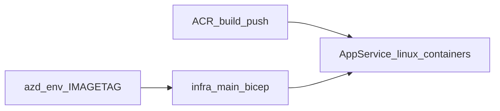

# Application Separation Plan: E-commerce + Chat Split

## Overview

This document outlines the plan to separate the current monolithic **Customer Chatbot Solution Accelerator** into two independent web applications:

1. **E-commerce Application** - Product browsing, cart management, and ordering
2. **Chat Application** - AI-powered customer support and assistance

## Current Architecture Analysis

### Existing Structure
```
src/
├── api/                          # Monolithic Backend (FastAPI)
│   └── app/
│       ├── routers/
│       │   ├── auth.py          # Shared: Authentication
│       │   ├── cart.py          # E-commerce: Shopping cart
│       │   ├── chat.py          # Chat: AI conversations
│       │   └── products.py      # E-commerce: Product management
│       ├── services/
│       │   ├── search.py        # Shared: Search functionality
│       │   └── user_onboarding.py
│       └── ...
└── App/                         # Monolithic Frontend (React)
    └── src/
        └── components/
            ├── CartDrawer.tsx           # E-commerce specific
            ├── ProductCard.tsx          # E-commerce specific
            ├── ProductGrid.tsx          # E-commerce specific
            ├── ChatPanel.tsx            # Chat specific
            ├── ChatMessageBubble.tsx    # Chat specific
            ├── LoginForm.tsx            # Shared component
            └── Layout/                  # Shared layout
```

## Target Architecture

### Separated Applications Structure
```
├── ecommerce-app/
│   ├── frontend/               # E-commerce React App
│   ├── backend/               # E-commerce FastAPI
│   └── infra/                 # E-commerce Azure resources
└── chat-app/
    ├── frontend/              # Chat React App  
    ├── backend/              # Chat FastAPI
    └── infra/                # Chat Azure resources
```

## Implementation status (progress to date)

The following is **in progress** in the repository; it is not aspirational-only.

| Area | Status |
|------|--------|
| **Layout** | `ecommerce-app/` and `chat-app/` each contain `backend/`, `frontend/`, `infra/` (full Bicep fork from root), and a root **`azure.yaml`** (infra-only, postprovision hooks). |
| **Backend split** | E-commerce [`ecommerce-app/backend/app/main.py`](../ecommerce-app/backend/app/main.py): **auth, products, cart, orders** (no chat, no voice). Chat [`chat-app/backend/app/main.py`](../chat-app/backend/app/main.py): **auth, chat, voice_live** only (no products/cart); Foundry message path uses **chat + policy** agents/tools only (no product agent). |
| **Frontend split** | E-commerce: shop + cart UI, header without chat control. Chat: **AI chat only**—single-column chat, header “Contoso Support”, no cart or product grid ([`chat-app/frontend/src/App.tsx`](../chat-app/frontend/src/App.tsx)). |
| **Azure provision** | Both stacks were **successfully provisioned** with `azd provision --no-prompt` in **Central US** (East US 2 hit Azure Search **InsufficientResourcesAvailable**). Example env names: **`ecomcu`** / **`chatcu`**; resource groups: **`rg-ccsa-ecomcu`** / **`rg-ccsa-chatcu`**. Example web URLs: `https://app-ecomcu3j3td.azurewebsites.net` and `https://app-chatculgjy7.azurewebsites.net` (suffixes vary per deployment). Async delete was started for the earlier partial RG **`rg-ccsa-ecomsplit`**; confirm removal in the portal if needed. |
| **Post-provision** | Run **`infra/scripts/data_scripts/`** (both apps) and **`infra/scripts/agent_scripts/`** (chat) from each app directory after deploy, as in root. |
| **Infra scope** | Each app still ships the **full** accelerator template (including AI resources); trimming e-commerce-only Azure resources remains a follow-up. |
| **Container images on deployed App Services** | Each app’s [`main.bicep`](../chat-app/infra/main.bicep) uses **per-app ACR repository names** (defaults **`ccsa-chat-frontend`** / **`ccsa-chat-backend`** vs **`ccsa-ecom-frontend`** / **`ccsa-ecom-backend`**) plus **`AZURE_ENV_IMAGETAG`**. Cloud-build with **`infra/scripts/build_frontend_acr`** / **`build_backend_acr`** (**.ps1** / **`.sh`**) or raw **`az acr build`**; see [`chat-app/infra/scripts/`](../chat-app/infra/scripts/) and [`ecommerce-app/infra/scripts/`](../ecommerce-app/infra/scripts/). Then **`azd provision`** (or redeploy) so **`linuxFxVersion`** matches. Optional: **`AZURE_ENV_FRONTEND_IMAGE_REPO`** / **`AZURE_ENV_BACKEND_IMAGE_REPO`**. Env vars are listed under **`documents/CustomizingAzdParameters.md`**. |
| **Local `npm run dev` (split frontends)** | From each app’s **`frontend/`** directory (not `src/`): **`npm install --legacy-peer-deps`**, then **`npm run dev`**. Stack uses **Vite 6**, **`@tailwindcss/vite`**, and Tailwind v4-style CSS. **Vite 8** (Rolldown) can hit native binding issues on some Windows setups; **Node ≥20.19** helps if you upgrade Vite later. |
| **Chat backend config** | Chat API uses accelerator-style [`config.py`](../chat-app/backend/app/config.py), [`auth.py`](../chat-app/backend/app/auth.py), and [`models.py`](../chat-app/backend/app/models.py) with existing Cosmos / Easy Auth paths. |

### Where this effort left off

- **Local frontends:** `npm run dev` is expected to work from each **`*/frontend`** root with the toolchain above; if Vite 8+ is reintroduced, prefer **Node ≥20.19** on Windows.
- **Azure runtime:** Bicep and **`build_frontend_acr`** / **`build_backend_acr`** scripts are in place; remaining work per environment is cloud-building images, setting **`AZURE_ENV_IMAGETAG`** (and optional repo overrides), then reprovisioning or updating web apps so **`linuxFxVersion`** matches (**`verify_linuxfx`**).

### Next: Azure images (split frontends)

1. Run **`build_frontend_acr`** and **`build_backend_acr`** under each app’s **`infra/scripts/`** (or equivalent **`az acr build`** commands) so **frontend** and **backend** images exist in the target registry at the repos **`linuxFxVersion`** expects.
2. Confirm **`AZURE_ENV_CONTAINER_REGISTRY_ENDPOINT`** and **`AZURE_ENV_IMAGETAG`** (and **`AZURE_ENV_FRONTEND_IMAGE_REPO`** / **`AZURE_ENV_BACKEND_IMAGE_REPO`** if overriding defaults) in each app’s azd environment.
3. **`azd provision`** (or update site config) and **verify** deployment (`infra/scripts/verify_linuxfx.ps1` / `verify_linuxfx.sh` and the checklist above).

**Post-deploy verification:** In Azure Portal (or `az webapp config show`), confirm the **frontend** App Service **Linux container** setting is **`DOCKER|<your-registry>/<frontendImageRepository>:<imageTag>`** (e.g. `ccsa-chat-frontend` for chat). Open **`WEB_APP_URL`**: chat app should show **Contoso Support** chat-only UI; ecommerce should show **shop + cart**.

## UI and Design Parity (Both Frontends)

The monolith today is built around **Fluent UI v9** (`@fluentui/react-components`, `@fluentui/react-icons`) with `FluentProvider`, `ThemeContext`, and the **coral brand theme** (`src/App/src/theme/coralTheme.ts`, `createLightTheme` / `createDarkTheme` brand ramp). Layout and chrome already use Fluent primitives (for example `AppHeader`, `CartDrawer`, `ChatSidebar`, `ErrorFallback`).

For **ecommerce-app/frontend** and **chat-app/frontend**:

- **Fluent UI first**: Use Fluent for navigation, buttons, inputs, drawers/dialogs, cards, typography, spinners, and message surfaces. Keep `@fluentui/react-components` and `@fluentui/react-icons` versions aligned with the monolith `src/App/package.json` (or centralize versions in a shared workspace package).
- **Same visual system**: Carry over `FluentProvider` + `ThemeProvider` + coral theme tokens and the existing global CSS entry pattern (`main.css`, `styles/theme.css`, `styles/coral.css`, `index.css`) so light/dark, brand color, and density match the accelerator.
- **Legacy UI (`components/ui`, Radix)**: Do not expand Radix or shadcn-style primitives for new work during the split; prefer Fluent. Keep existing wrappers only where migration cost is high, and converge over time so both apps read as one product family.
- **Shared patterns**: Duplicate or extract shared pieces (header/toolbars, auth controls, error boundary UI) from the same source tree or a small shared package so both apps stay visually consistent.

Tailwind may remain where the current app already uses it for utilities; **Fluent is the component layer** for new and refactored surfaces.

---

## 1. E-commerce Application

### 1.1 Backend Structure (`ecommerce-app/backend/`)

```
ecommerce-app/backend/
├── app/
│   ├── main.py                    # FastAPI app entry point
│   ├── config.py                  # E-commerce specific config
│   ├── models.py                  # Product, Cart, Order models
│   ├── auth.py                    # Authentication (shared logic)
│   ├── routers/
│   │   ├── auth.py               # Auth endpoints
│   │   ├── products.py           # Product CRUD operations
│   │   ├── cart.py               # Shopping cart operations
│   │   └── orders.py             # Order management (new)
│   ├── services/
│   │   ├── product_service.py    # Product business logic
│   │   ├── cart_service.py       # Cart business logic
│   │   ├── search_service.py     # Product search
│   │   └── payment_service.py    # Payment processing (new)
│   └── utils/
│       └── database.py           # Cosmos DB connection
├── requirements.txt              # E-commerce dependencies
├── Dockerfile
└── .env.example
```

### 1.2 Frontend Structure (`ecommerce-app/frontend/`)

```
ecommerce-app/frontend/
├── src/
│   ├── App.tsx                   # Main e-commerce app
│   ├── main.tsx                  # App entry point
│   ├── theme/
│   ├── contexts/
│   ├── components/
│   │   ├── Layout/
│   │   │   ├── Header.tsx        # E-commerce header with cart
│   │   │   ├── Footer.tsx        # E-commerce footer
│   │   │   └── Navigation.tsx    # Product categories nav
│   │   ├── Product/
│   │   │   ├── ProductCard.tsx
│   │   │   ├── ProductGrid.tsx
│   │   │   ├── ProductFilters.tsx
│   │   │   └── ProductDetails.tsx
│   │   ├── Cart/
│   │   │   ├── CartDrawer.tsx
│   │   │   ├── CartItem.tsx
│   │   │   └── Checkout.tsx
│   │   ├── Auth/
│   │   │   ├── LoginForm.tsx
│   │   │   └── RegisterForm.tsx
│   │   └── ui/                   # Shared UI components
│   ├── pages/
│   │   ├── Home.tsx
│   │   ├── Products.tsx
│   │   ├── ProductDetail.tsx
│   │   ├── Cart.tsx
│   │   └── Orders.tsx
│   ├── hooks/
│   │   ├── useProducts.ts
│   │   ├── useCart.ts
│   │   └── useAuth.ts
│   └── lib/
│       └── api.ts               # E-commerce API calls
├── package.json
├── vite.config.ts
└── .env.example
```

### 1.3 Key Dependencies (E-commerce)
```json
{
  "backend": [
    "fastapi",
    "azure-cosmos",
    "azure-search-documents",
    "azure-identity",
    "pydantic"
  ],
  "frontend": [
    "react",
    "react-dom",
    "vite",
    "@fluentui/react-components",
    "@fluentui/react-icons",
    "@tanstack/react-query",
    "react-router-dom",
    "axios",
    "react-error-boundary",
    "tailwindcss"
  ]
}
```

---

## 2. Chat Application

### 2.1 Backend Structure (`chat-app/backend/`)

```
chat-app/backend/
├── app/
│   ├── main.py                    # FastAPI app entry point
│   ├── config.py                  # Chat specific config
│   ├── models.py                  # Chat, Message, Session models
│   ├── auth.py                    # Authentication (shared logic)
│   ├── routers/
│   │   ├── auth.py               # Auth endpoints
│   │   ├── chat.py               # Chat conversations
│   │   └── sessions.py           # Chat session management
│   ├── services/
│   │   ├── chat_service.py       # Chat orchestration
│   │   ├── agent_service.py      # AI agent management
│   │   └── foundry_service.py    # Azure AI Foundry integration
│   ├── plugins/                  # AI agent plugins
│   │   ├── product_lookup.py     # Product search agent
│   │   └── policy_agent.py       # Policy knowledge agent
│   └── utils/
│       ├── database.py           # Cosmos DB connection
│       └── foundry_client.py     # Azure AI client
├── requirements.txt              # Chat dependencies
├── Dockerfile
└── .env.example
```

### 2.2 Frontend Structure (`chat-app/frontend/`)

```
chat-app/frontend/
├── src/
│   ├── App.tsx                   # Main chat app
│   ├── main.tsx                  # App entry point
│   ├── theme/
│   ├── contexts/
│   ├── components/
│   │   ├── Layout/
│   │   │   ├── Header.tsx        # Chat app header
│   │   │   └── Sidebar.tsx       # Chat sessions sidebar
│   │   ├── Chat/
│   │   │   ├── ChatPanel.tsx
│   │   │   ├── ChatMessageBubble.tsx
│   │   │   ├── EnhancedChatPanel.tsx
│   │   │   ├── MessageInput.tsx
│   │   │   └── TypingIndicator.tsx
│   │   ├── Cards/
│   │   │   ├── ChatProductCard.tsx    # Product recommendations in chat
│   │   │   └── ChatOrderCard.tsx      # Order status in chat
│   │   ├── Auth/
│   │   │   ├── LoginForm.tsx
│   │   │   └── LoginButton.tsx
│   │   └── ui/                   # Shared UI components
│   ├── pages/
│   │   ├── Chat.tsx
│   │   ├── Sessions.tsx
│   │   └── Settings.tsx
│   ├── hooks/
│   │   ├── useChat.ts
│   │   ├── useSessions.ts
│   │   └── useAuth.ts
│   └── lib/
│       └── api.ts               # Chat API calls
├── package.json
├── vite.config.ts
└── .env.example
```

### 2.3 Key Dependencies (Chat)
```json
{
  "backend": [
    "fastapi",
    "azure-ai-projects",
    "agent-framework-azure-ai",
    "azure-cosmos",
    "azure-identity",
    "openai"
  ],
  "frontend": [
    "react",
    "react-dom",
    "vite",
    "@fluentui/react-components",
    "@fluentui/react-icons",
    "@tanstack/react-query",
    "react-router-dom",
    "axios",
    "react-error-boundary",
    "marked",
    "react-markdown",
    "tailwindcss"
  ]
}
```

---

## 3. Infrastructure Separation

Align split-app infrastructure with the **existing repository pattern**: root `azure.yaml` is **infra-only** (no `services:` block). `infra/main.bicep` provisions a **Linux App Service plan**, two **Linux Web Apps for Containers** (`kind: app,linux,container`), and supporting resources using the same **AVM / module** style as today (`infra/modules/web-sites.bicep`, `web-sites.config.bicep`, `role-assignment.bicep`, `virtualNetwork.bicep`, `ai-project.bicep`, `ai-services-deployments.bicep`, etc.). Containers use `DOCKER|<acrLoginServer>/<frontendImageRepository>:<imageTag>` and `DOCKER|<acrLoginServer>/<backendImageRepository>:<imageTag>` (per-app defaults such as `ccsa-chat-frontend` / `ccsa-ecom-frontend`); `containerRegistryEndpoint`, `imageTag`, and optional `${AZURE_ENV_FRONTEND_IMAGE_REPO}` / `${AZURE_ENV_BACKEND_IMAGE_REPO}` come from `infra/main.parameters.json`.

### 3.1 Bicep strategy (fork, do not reinvent)

- **E-commerce `ecommerce-app/infra/`**: Start from a **copy of** `infra/` at repo root. **Remove or gate** AI-specific resources and backend app settings (Azure AI Foundry project, agent API env vars, Voice Live, product/policy agent IDs where not needed). Keep Cosmos DB, Azure AI Search (product index paths), storage, networking flags, and the **two-site App Service** pattern. Backend `ALLOWED_ORIGINS_STR` must list the **e-commerce** frontend default hostname (`https://app-${solutionSuffix}.azurewebsites.net` or your chosen naming). Frontend app settings keep **`VITE_API_BASE_URL`** pointing at that stack’s backend hostname.
- **Chat `chat-app/infra/`**: Start from the same `infra/` baseline and **retain** cognitive services, AI project, model deployments, search indexes used for policies/transcripts, and backend settings for Foundry agents and optional voice. Trim product-only routes only if the chat backend no longer serves them.
- **Module names**: Reuse existing file names under `infra/modules/` rather than introducing parallel `app-service.bicep` / `cdn.bicep` trees unless you add genuinely new resources.
- **App Service topology**: Default remains **one App Service plan** and **two web apps** (API + static SPA container) per environment, matching current cost and ops model. Document a deliberate change if you split plans for isolation.

### 3.2 Directory layout (each app)

```
ecommerce-app/
├── azure.yaml
├── infra/
│   ├── main.bicep
│   ├── main.parameters.json
│   ├── main_custom.bicep          # optional, if you mirror repo
│   ├── modules/                   # same module set as root, pruned as needed
│   └── scripts/
│       └── data_scripts/          # product upload; no agent scripts
└── ...

chat-app/
├── azure.yaml
├── infra/
│   ├── main.bicep
│   ├── main.parameters.json
│   ├── modules/
│   └── scripts/
│       ├── data_scripts/          # if still needed for search corpora
│       └── agent_scripts/         # Foundry agent creation (mirror root)
└── ...
```

### 3.3 Key Azure resources (summary)

| Area | E-commerce emphasis | Chat emphasis |
|------|---------------------|----------------|
| Compute | Linux App Service plan + API + frontend containers | Same pattern |
| Data | Cosmos DB, Search (products) | Cosmos DB, Search (policies / transcripts as today) |
| AI | Omit or minimal | AI Services account, AI Foundry project, deployments, RBAC to backend MI |
| Observability | Optional Application Insights via existing parameters | Same |

### 3.4 Repository layout vs two roots

**Default recommendation (monorepo)**: Keep one Git repository with `ecommerce-app/azure.yaml` and `chat-app/azure.yaml`. Run `azd` from each app directory (`cd ecommerce-app` then `azd up`) so each has its own `.azure/<env>/` state and resource group naming. **Alternative**: two repositories each containing a copy of the forked `infra/`; same Bicep rules apply.



---

## 4. Inter-Service Communication

### 4.1 API Integration Points

When chat needs e-commerce data or vice versa:

```typescript
const ecommerceApiBase = import.meta.env.VITE_ECOMMERCE_API_URL;

fetch(`${ecommerceApiBase}/api/products/${productId}`, {
  headers: { Authorization: `Bearer ${token}` },
});

fetch(`${ecommerceApiBase}/api/cart`, {
  headers: { Authorization: `Bearer ${token}` },
});
```

```python
# E-commerce app calling chat API (for support widget)
chat_api_base = os.getenv("CHAT_API_BASE_URL")

# Create support chat session
requests.post(f"{chat_api_base}/api/chat/sessions", 
              json={"user_id": user_id, "context": "ecommerce_support"})
```

### 4.2 Shared Authentication Strategy

**Option 1: Shared Auth Service**
- Single authentication microservice
- JWT tokens valid across both apps
- Shared user database

**Option 2: Independent Auth with SSO**
- Each app has own auth
- Azure AD B2C for single sign-on
- Token exchange between services

---

## 5. Database Strategy

### 5.1 Database Separation Options

**Option A: Separate Databases**
```
ecommerce_db (Cosmos DB)
├── products/          # Product catalog
├── carts/            # Shopping carts  
├── orders/           # Order history
└── customers/        # Customer profiles

chat_db (Cosmos DB)  
├── sessions/         # Chat sessions
├── messages/         # Chat messages
├── agents/           # Agent configurations
└── knowledge/        # Knowledge base
```

**Option B: Shared Database with Logical Separation**
```
shared_db (Cosmos DB)
├── ecommerce/
│   ├── products/
│   ├── carts/
│   └── orders/
└── chat/
    ├── sessions/
    ├── messages/
    └── agents/
```

### 5.2 Recommended Approach: Separate Databases
- **Pros**: True independence, separate scaling, security isolation
- **Cons**: Data synchronization complexity, cross-service queries
- **Mitigation**: API-based data access, event-driven synchronization

---

## 6. Deployment Strategy

### 6.1 How `azd up` works in this accelerator (baseline)

Provisioning is **Bicep-driven**. Container images are expected to exist in **Azure Container Registry** (or another registry referenced by `containerRegistryEndpoint`). CI and local flows typically:

1. Build images in ACR with per-stack repositories (defaults **`ccsa-chat-frontend`** / **`ccsa-chat-backend`** vs **`ccsa-ecom-frontend`** / **`ccsa-ecom-backend`**): run **`infra/scripts/build_frontend_acr`** and **`build_backend_acr`** (**.ps1** / **`.sh`**) from each app. CI may substitute **`az acr build`** (for example `.github/workflows/job-docker-build.yml`).
2. Set azd environment values used by `infra/main.parameters.json` (**`AZURE_ENV_IMAGETAG`**, **`AZURE_ENV_CONTAINER_REGISTRY_ENDPOINT`**, optional **`AZURE_ENV_FRONTEND_IMAGE_REPO`** / **`AZURE_ENV_BACKEND_IMAGE_REPO`**, plus **`AZURE_LOCATION`**, **`AZURE_ENV_AI_SERVICE_LOCATION`** where AI applies, model parameters, optional existing Log Analytics / AI project IDs).
3. Run **`azd up`** from the directory whose `azure.yaml` points at the correct `infra/` path. Bicep updates the App Service `linuxFxVersion` pins and **application settings** (backend secrets and URLs; frontend **`VITE_API_BASE_URL`** set to the deployed API default hostname).

Post-provision user steps today are documented in root `azure.yaml` **`hooks.postprovision`**: product data scripts under `infra/scripts/data_scripts/` and agent scripts under `infra/scripts/agent_scripts/`. Split apps should **split those messages and paths** (e-commerce hook emphasizes data upload only; chat hook emphasizes agent setup).

### 6.2 Independent AZD deployments (per app)

```bash
cd ecommerce-app
azd auth login
azd env new ecommerce-prod
azd up

cd ../chat-app
azd auth login
azd env new chat-prod
azd up
```

Each app directory needs: **`azure.yaml`** (infra path + hooks), **`infra/main.bicep`**, **`infra/main.parameters.json`**, and optionally the same **`requiredVersions.azd`** constraint as the monolith. Azd creates **`.azure/<environment>/`** with state and values; do not hand-author fictional placeholder keys for Container Apps domains.

### 6.3 `azure.yaml` shape (mirror root, no `services:`)

Model each app on the repository root file: `name`, `metadata.template`, `requiredVersions.azd`, `infra.path: infra`, and **`hooks.postprovision`** with `windows` (`pwsh`) and `posix` (`sh`) blocks that print the **WEB_APP_URL** (or equivalent output from your forked Bicep) and the correct follow-up scripts for that app only.

Example skeleton (both apps follow this structure; names and hook script paths differ):

```yaml
name: ecommerce-app
metadata:
  template: ecommerce-app@0.0.1
requiredVersions:
  azd: ">= 1.18.0 != 1.23.9"
hooks:
  postprovision:
    windows:
      run: |
        Write-Host "Web app URL:"
        Write-Host "$env:WEB_APP_URL"
        Write-Host "Run infra\\scripts\\data_scripts\\run_upload_data_scripts.ps1"
      shell: pwsh
      continueOnError: false
      interactive: true
    posix:
      run: |
        echo "Web app URL:"
        echo "$WEB_APP_URL"
        echo "Run ./infra/scripts/data_scripts/run_upload_data_scripts.sh"
      shell: sh
      continueOnError: false
      interactive: true
infra:
  path: infra
```

Chat app: keep the same skeleton; postprovision text should point at **`infra/scripts/agent_scripts/`** (and any data scripts still required for search indexes).

### 6.4 Parameters and outputs (parity with `main.parameters.json`)

Forked `main.parameters.json` should keep the same **substitution style** as the monolith: `solutionName` from `${AZURE_ENV_NAME}`, `location` from `${AZURE_LOCATION}`, `azureAiServiceLocation` from `${AZURE_ENV_AI_SERVICE_LOCATION}`, `containerRegistryEndpoint` from `${AZURE_ENV_CONTAINER_REGISTRY_ENDPOINT}`, `imageTag` from `${AZURE_ENV_IMAGETAG=latest_v2}`, optional existing workspace and AI project resource IDs, model name and capacity fields, etc. Add Bicep **outputs** for URLs used by hooks and CI (for example **`WEB_APP_URL`**) consistent with your template changes.

### 6.5 CORS and frontend API URL

Backend App Service settings in `infra/main.bicep` use **`ALLOWED_ORIGINS_STR`** set to the **frontend** default hostname (HTTPS). After split, each **`main.bicep`** must set this to **that stack’s** frontend URL pattern (for example `https://app-${solutionSuffix}.azurewebsites.net` or renamed site names if you change `webSiteResourceName`). The paired frontend web app must expose **`VITE_API_BASE_URL`** (or additional `VITE_*` URLs for cross-app calls) matching the **same** environment’s backend hostname so the SPA and CORS stay aligned.

### 6.6 Optional: Container Apps

If you later move compute to Azure Container Apps, treat that as a **separate migration** with its own `azure.yaml` `services:` definitions; it is **not** the current accelerator model.

---

## 7. Migration Steps

### Phase 1: Code Separation (Week 1-2)

1. **Create new directory structure**
   ```bash
   mkdir ecommerce-app chat-app
   mkdir ecommerce-app/{frontend,backend,infra}
   mkdir chat-app/{frontend,backend,infra}
   ```

2. **Backend separation**
   - Copy `src/api/` to both `ecommerce-app/backend/` and `chat-app/backend/`
   - Remove chat-related code from e-commerce backend
   - Remove e-commerce-related code from chat backend
   - Update imports and dependencies

3. **Frontend separation**
   - Copy `src/App/` to both apps' frontend directories
   - Remove chat components from e-commerce frontend
   - Remove e-commerce components from chat frontend
   - Update routing and navigation

### Phase 2: Infrastructure Setup (Week 3)

**🎯 Priority: Ensure `azd up` works for both apps**

1. **Create AZD-compatible infrastructure**
   ```bash
   # E-commerce infrastructure
   mkdir ecommerce-app/infra
   cp infra/main.bicep ecommerce-app/infra/main.bicep
   # Remove chat-specific modules
   # Add ecommerce-specific parameter definitions
   
   # Chat infrastructure  
   mkdir chat-app/infra
   cp infra/main.bicep chat-app/infra/main.bicep
   # Remove ecommerce-specific modules
   # Add AI Foundry and OpenAI modules
   ```

2. **Configure AZD project files**
   - Add `ecommerce-app/azure.yaml` and `chat-app/azure.yaml` modeled on root `azure.yaml`: `infra.path`, `requiredVersions.azd`, and `hooks.postprovision` (split data vs agent follow-ups). Do not add `services:` unless you intentionally adopt Container Apps.
   - Copy `infra/main.parameters.json` into each app’s `infra/` and trim parameters only where the forked `main.bicep` removes corresponding `param` declarations.

3. **Test independent deployments**
   ```bash
   # Validate e-commerce deployment
   cd ecommerce-app && azd provision --dry-run
   
   # Validate chat deployment  
   cd chat-app && azd provision --dry-run
   ```

4. **Database migration with AZD automation**
   - Create post-deployment scripts for data migration
   - Ensure connection strings auto-populate via AZD
   - Add RBAC role assignments in Bicep templates

### Phase 3: Integration & Testing (Week 4)

1. **Implement cross-service APIs**
   - Add API endpoints for inter-service communication
   - Implement authentication/authorization
   - Add error handling and retry logic

2. **End-to-end testing**
   - Test independent deployments
   - Verify cross-service communication
   - Performance and security testing

### Phase 4: Production Deployment (Week 5)

1. **AZD deployment validation**
   ```bash
   # Test complete e-commerce deployment
   cd ecommerce-app
   azd init --template .
   azd auth login
   azd up --environment staging
   
   # Verify all services are running
   azd show --environment staging
   
   # Test complete chat deployment
   cd chat-app  
   azd init --template .
   azd auth login
   azd up --environment staging
   
   # Verify AI agents are deployed
   azd show --environment staging
   ```

2. **Production cutover with AZD**
   ```bash
   # Production deployment - E-commerce
   cd ecommerce-app && azd up --environment production
   
   # Production deployment - Chat
   cd chat-app && azd up --environment production
   ```
   - Observe health and telemetry via `azd show`, Application Insights (if enabled), and the Azure portal; align with existing CI deploy workflows.
   - Rollback: redeploy a known-good **`AZURE_ENV_IMAGETAG`** (and matching Bicep revision) or use `azd down` / redeploy with prior environment state as appropriate for your team policy.

---

## 8. Benefits of Separation

### Technical Benefits
- **Independent scaling** - Scale chat and e-commerce separately based on demand
- **Infrastructure flexibility** - Size AI vs commerce resources independently while keeping the same Fluent UI and App Service deployment conventions
- **Deployment independence** - Deploy features without affecting other services
- **Fault isolation** - Issues in one app don't break the other
- **Security boundaries** - Separate access controls and data isolation

### Business Benefits
- **Team autonomy** - Separate teams can own each application
- **Feature velocity** - Faster development cycles
- **Cost optimization** - Pay only for resources each app needs
- **Compliance** - Easier to meet different regulatory requirements

### Operational Benefits
- **Monitoring clarity** - Separate metrics and alerting per application
- **Maintenance windows** - Independent update schedules
- **Resource optimization** - Right-sized infrastructure per workload

---

## 9. Considerations & Risks

### Challenges
- **Increased complexity** - Managing two deployments vs one
- **Data consistency** - Synchronizing shared data across services
- **Network latency** - Cross-service API calls add latency  
- **Development overhead** - More repositories, configurations, deployments

### Mitigation Strategies
- **Shared libraries** - Common authentication, utilities, UI components
- **Event-driven architecture** - Eventual consistency for non-critical data
- **Caching strategies** - Reduce cross-service API calls
- **Monitoring & observability** - Comprehensive logging and tracing
- **Documentation** - Clear API contracts and integration guides

---

## 11. AZD Deployment Validation

### 11.1 Pre-Deployment Checklist

**E-commerce app**
- [ ] `azure.yaml` uses `infra.path` and `hooks.postprovision` (no required `services:` for current model)
- [ ] `infra/main.bicep` forked from repo; AI-only resources removed or disabled as intended
- [ ] `infra/main.parameters.json` matches `main.bicep` parameters (registry, `imageTag`, locations, optional existing resources)
- [ ] ACR images exist for this stack’s **`frontendImageRepository`** / **`backendImageRepository`** (defaults **`ccsa-ecom-frontend`** / **`ccsa-ecom-backend`**); **`AZURE_ENV_IMAGETAG`** and optional repo overrides set before **`azd up`** (**`infra/scripts/build_frontend_acr`** and **`build_backend_acr`**)
- [ ] Backend App Service **`ALLOWED_ORIGINS_STR`** matches this stack’s frontend URL; frontend app setting **`VITE_API_BASE_URL`** matches backend default hostname
- [ ] Backend health: **`/health`** responds after deploy
- [ ] Post-provision: product / search data scripts documented (e.g. `infra/scripts/data_scripts/`)

**Chat app**
- [ ] Same `azure.yaml` / parameters / image-tag discipline as e-commerce (defaults **`ccsa-chat-frontend`** / **`ccsa-chat-backend`**; **`build_frontend_acr`** and **`build_backend_acr`**)
- [ ] `infra/main.bicep` retains AI Services, Foundry project, deployments, and backend env vars required by the chat API
- [ ] RBAC from backend managed identity to Cosmos, Search, and AI project / account matches forked template
- [ ] Post-provision: agent creation scripts documented (e.g. `infra/scripts/agent_scripts/`)
- [ ] Optional: Application Insights wiring if `enableMonitoring`-style flags are kept

### 11.2 Deployment validation commands

Set real values for resource group, API host from `azd show` or Bicep outputs, and image tag in your shell before `curl`.

**E-commerce**
```bash
cd ecommerce-app
azd provision --dry-run
azd up --environment test
azd show
curl -sS "https://${ECOMMERCE_API_HOST}/health"
curl -sS -o /dev/null -w "%{http_code}" "https://${ECOMMERCE_WEB_APP_URL}/"
azd down --environment test --purge
```

**Chat**
```bash
cd chat-app
azd provision --dry-run
azd up --environment test
azd show
curl -sS "https://${CHAT_API_HOST}/health"
azd down --environment test --purge
```

Use the Azure portal or Application Insights for live metrics and failures; **`azd show`** lists outputs and environment linkage for the selected environment.

### 11.3 Troubleshooting AZD deployment issues

1. **Resource providers** — Register namespaces the template requires (for example `Microsoft.CognitiveServices`, `Microsoft.DocumentDB`; add `Microsoft.AI` if your subscription uses it for AI resources).

2. **Quotas** — Chat stack: verify model deployment quota in the chosen `azureAiServiceLocation` before `azd up`.

3. **RBAC propagation** — Role assignments can lag; agent and data scripts should retry or wait (order of minutes) before first AI or data plane calls.

4. **Stale or wrong container** — Confirm **`AZURE_ENV_IMAGETAG`**, **`AZURE_ENV_CONTAINER_REGISTRY_ENDPOINT`**, and optional **`AZURE_ENV_FRONTEND_IMAGE_REPO`** / **`AZURE_ENV_BACKEND_IMAGE_REPO`** match **`linuxFxVersion`** (**`infra/scripts/verify_linuxfx.ps1`** or **`.sh`**); restart site or redeploy if settings changed.

5. **CORS failures** — Reconcile **`ALLOWED_ORIGINS_STR`** on the API with the exact browser origin (scheme + host, no trailing slash mismatch).

---

## 10. Success Metrics

### Technical KPIs
- **Deployment frequency** - Independent releases per week
- **System availability** - 99.9% uptime for each service
- **Response times** - <200ms API response times
- **Error rates** - <0.1% error rate across services

### Business KPIs
- **Development velocity** - Feature delivery time reduction
- **System reliability** - Reduced system-wide outages
- **Cost efficiency** - Lower operational costs per transaction
- **User satisfaction** - Maintained user experience quality

---

This plan provides a comprehensive roadmap for separating the monolithic customer chatbot solution into two independent, scalable web applications while maintaining functionality and improving operational efficiency.